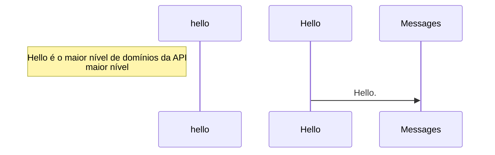
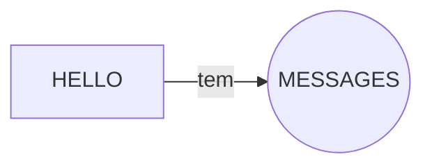

# traffic-infractions

### Introdução:

API de exemplo para Criação de projetos em NodeJs pela Creare Sistemas
A documentação da API encontra-se em https://apidoc.crearesistemas.com.br ou off-line na pasta docs do projeto.


A API segue a seguinte estrutura de domínios:

TODO:



Fluxo:



As mensagens cadastradas podem ser consultadas e excluídas

### Passos para fazer uma utilização básica:

1. Criar um Mensagem(Hello)
2. Excluir uma Mensagem(Hello)
3. consultar uma mensagem por hello Id


### Stack

| Responsability     | What        |
| ------------------ | ----------- |
| JS Spec            | ES6         |
| Process Managament | PM2         |
| Code Standard      | ESLint      |
| Logs               | Winston     |
| HTTP Headers       | Helmet      |
| Test Runner        | Mocha       |
| DB                 | knex        |
| CORS               | CORS        |
| Body Parsing       | Body Parser |
| Versioning         | SemVer      |

### Installing and running the app with PM2

```sh
$ npm install
$ npm install -g pm2
$ npm start
```

### Running in dev with nodemon

```sh
$ npm install
$ npm install -g nodemon
$ npm run dev
```

### Docker

```sh
# Build image
$ docker build -t crearesistemas/app .

# List images
$ docker images

# Run images
$ docker run -p 49160:3000 -d crearesistemas/app

# Get container id
$ docker ps

# App output
$ docker logs -f <container id>

# Run commands inside the container
$ docker exec -it <container id> /bin/bash
examples:
$ docker exec -it <container id> pm2 list

```

### PM2

#### Running PM2 on server boots

```sh
$ pm2 startup systemd
```

Logs

```sh
$ cd $HOME/.pm2/logs
```

### ESLint comands to run check code

```sh
$ npm install eslint --save-dev
$ ./node_modules/.bin/eslint src/
```
